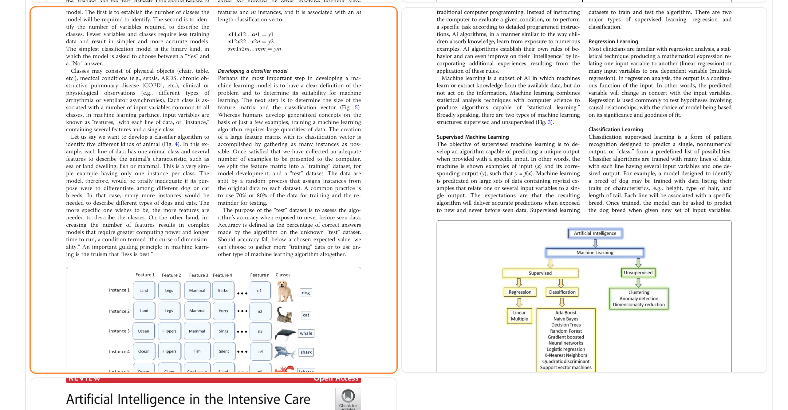

# FancyLibrary

#### 主要功能
FancyLibrary 是一个智能多模态知识管理平台，能够帮助用户高效地组织、搜索和利用各类文档及媒体资料，提供精准的答案和洞察
* 智能多模态检索：FancyLibrary能够处理文本、图像和视频等多种类型的内容，从中检索出最相关的信息。
* 上下文理解与问答：通过先进的自然语言处理技术，能够理解用户的查询意图，并提供准确的答案。
* 个性化推荐：根据用户的阅读历史和偏好，为用户提供个性化的内容推荐。
* 跨平台支持：可在多种操作系统和设备上使用，方便用户随时随地访问

### 使用说明
通过gradio构建交互式应用
安装`依赖`: 
```bash
pip install -r requirements.txt
python app.py
```


#### 参与贡献

1.  Fork 本仓库
2.  新建 Feat_xxx 分支
3.  提交代码
4.  新建 Pull Request


#### demo演示




